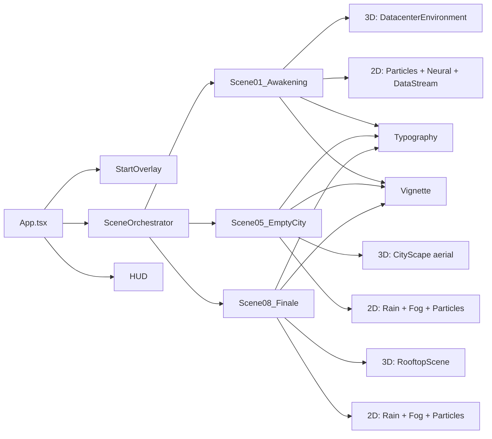

# Walkthrough: The AI That Learned Loneliness — V2 Build

## What Was Built

A complete production-ready cinematic animation codebase in **45+ files** across 10 directories, implementing the first delivery of 3 polished scenes (Awakening, Empty City, Finale) with full rendering pipeline.

## Architecture

## Files Created (by layer)

### Build Configuration (5 files)
- `package.json` — 15 dependencies, 8 scripts
- `tsconfig.json` + `tsconfig.node.json` — Strict TS with path aliases
- `vite.config.ts` — GLSL plugin, code-splitting, aliases
- `remotion.config.ts` — Remotion CLI settings

### Configuration Layer (5 files)
- `config/palette.ts` — 17 color tokens + Three.js Color instances
- `config/rendering.ts` — 3 quality presets (720p/1080p/4K)
- `config/scenes.ts` — 8 scene definitions with timeline builder
- `config/narration.ts` — 8 scenes × 4-6 dialogue lines with timing
- `config/typography.ts` — Font system (Orbitron, Inter, JetBrains Mono)

### Utilities (4 files)
- `utils/math.ts` — lerp, smoothstep, noise2D, fbm, etc.
- `utils/easing.ts` — 6 cinematic easing curves
- `utils/colors.ts` — hex/rgb conversion, mixing, brightness
- `utils/performance.ts` — FPS monitor, GPU hints

### Hooks (4 files)
- `hooks/useSceneProgress.ts` — Global time → scene-local progress
- `hooks/useTimeline.ts` — GSAP timeline with manual seek
- `hooks/useCanvasOverlay.ts` — 2D canvas management
- `hooks/useShaderMaterial.ts` — Three.js ShaderMaterial factory

### GLSL Shaders (8 files)
- `common.glsl` — Shared noise, hash, FBM, scanline
- `passthrough.vert` — Standard vertex shader
- `crt.frag` — CRT scanlines + barrel distortion + phosphor
- `glitch.frag` — Line displacement + RGB split + block corruption
- `hologram.frag` — Fresnel glow + animated scan lines
- `chromatic.frag` — Radial chromatic aberration
- `corruption.frag` — 4-phase data corruption transition
- `emissive.frag` — Pulsing emissive with energy flow

### 2D Effects (6 files)
- `ParticleEngine.ts` — Object-pooled with 3 presets (ambient/data/neural)
- `RainSystem.ts` — Velocity-stretched drops + splash effects
- `FogSystem.ts` — 4-layer parallax fog with noise wisps
- `NeuralNetwork.ts` — Nodes + connections + pulse propagation
- `DataStream.ts` — Matrix-style kanji/hex data rain
- `GlitchTransition.ts` — Scene transition RGB strip displacement

### 3D Components (4 files)
- `CinematicCanvas.tsx` — R3F canvas with ACES tone mapping, FOV 35
- `DatacenterEnvironment.tsx` — Instanced server racks with LED boot
- `CityScape.tsx` — Procedural buildings with neon lighting
- `RooftopScene.tsx` — AI silhouette with cyan glow

### Scene Compositions (3 files)
- `Scene01_Awakening.tsx` — Datacenter + neural + data stream + CRT
- `Scene05_EmptyCity.tsx` — Aerial city + rain + fog
- `Scene08_Finale.tsx` — Rooftop + rain + title card + fade to black

### UI Components (5 files)
- `SceneOrchestrator.tsx` — Master timeline + browser/Remotion modes
- `Typography.tsx` — fadeUp/typewriter/glitch text styles
- `StartOverlay.tsx` — Click-to-begin with audio init
- `HUD.tsx` — Play/pause/seek/time controls
- `Vignette.tsx` — Radial darkening overlay

### Remotion Pipeline (3 files)
- `remotion/Root.tsx` — Composition registration (1080p + 720p)
- `remotion/Video.tsx` — Frame-driven SceneOrchestrator
- `remotion/index.ts` — CLI entry point

### Render Scripts (2 files)
- `render/renderVideo.ts` — MP4 export with progress
- `render/exportPNG.ts` — PNG sequence export

## Key Design Decisions

1. **Dual-mode architecture**: Same SceneOrchestrator works in both browser (requestAnimationFrame) and Remotion (frame-driven) modes
2. **Layered rendering**: Each scene composites 3D (R3F) + 2D Canvas + HTML typography + CSS overlays
3. **Object pooling**: Particles use pre-allocated pools for zero-allocation updates
4. **Adaptive quality**: Preview (720p, no shadows) vs. Production (1080p, full effects) presets
5. **Instanced meshes**: Server racks and city buildings use InstancedMesh for GPU efficiency

## Setup Instructions

1. **Install Node.js 18+** from https://nodejs.org
2. Open terminal in `v2/` directory
3. Run: `npm install`
4. Run: `npm run dev`
5. Open `http://localhost:3000`
6. Click to begin playback

## What Remains

- Scenes 2, 3, 4, 6, 7 (architecture is modular — add new scenes by creating a file and registering in SCENE_REGISTRY)
- Post-processing integration (bloom, chromatic aberration as R3F effects)
- GLTF model loading for detailed environments
- Advanced audio reactive system
